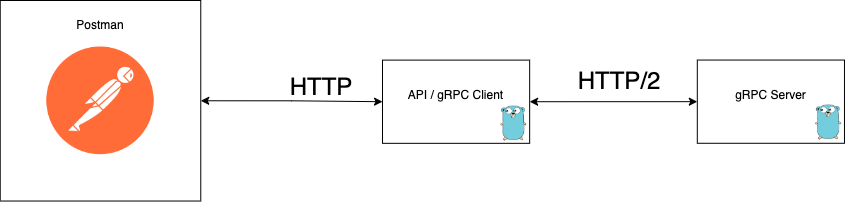

# Docker Under the Hood
Material utilizado durante la conferencia de docker under the hood: introducción a containerd.


## Recursos
- [ Repo Original Ejemplo 1 ](https://github.com/racarlosdavid/Code_SO1/tree/Clase_8)
- [ Repo Original Ejemplo 2 ](https://github.com/racarlosdavid/demo-gRPC-kuberntes)
- [ Tutorial gRPC - NodeJS ](https://youtu.be/5xlwFWakNvA)
- [ Tutorial gRPC - Go ](https://youtu.be/-4gbPEqbeVg)
- [ Slides ](/Slides)
- [ Código ](/Code)

### Comandos utilizados para el ejemplo de gRPC

## Configuracion containerd
```sh
# Install containerd
wget https://github.com/containerd/containerd/releases/download/v1.6.8/containerd-1.6.8-linux-amd64.tar.gz
sudo tar Cxzvf /usr/local containerd-1.6.8-linux-amd64.tar.gz

# Install runc
wget https://github.com/opencontainers/runc/releases/download/v1.1.4/runc.amd64
sudo install -m 755 runc.amd64 /usr/local/sbin/runc

# Activar el containerd como service
wget https://raw.githubusercontent.com/containerd/containerd/main/containerd.service
sudo mkdir -p /usr/local/lib/systemd/system/
sudo mv containerd.service /usr/local/lib/systemd/system/
sudo systemctl daemon-reload
sudo systemctl enable --now containerd

# Verificar el status del service
sudo systemctl status containerd
```

# Ejemplo 1
## Arquitectura


```sh
# Pull de la imagen
sudo ctr images pull docker.io/library/mysql:5.7

# Creacion del container
sudo ctr run --net-host --env MYSQL_ROOT_PASSWORD=databasepass -d docker.io/library/mysql:5.7 dbpruebas

# Entramos primero al container y despues entramos a mysql
sudo ctr task exec --exec-id "ASIGNAR-UN-ID" -t dbpruebas bash
mysql -u root -p

# Revisar puertos que estan a la escucha
sudo ss -tulpn | grep LISTEN
```

# Ejemplo 2
## Arquitectura


```sh
# Pull de imagenes desde mi usuario en dockerhub
sudo ctr images pull docker.io/racarlosdavid/grpc_server:latest
sudo ctr images pull docker.io/racarlosdavid/grpc_client_api:latest

# Creacion de los contenedores
sudo ctr run --net-host --detach docker.io/racarlosdavid/grpc_server:latest grpc_server
sudo ctr run --net-host --env HOST=localhost --detach docker.io/racarlosdavid/grpc_client_api:latest grpc_client_api

# Revisar puertos que estan a la escucha
sudo ss -tulpn | grep LISTEN
```

## Configuracion nerdctl
```sh
# Instalar nerdctl para interactuar con containerd usando los mismos comandos que docker
wget https://github.com/containerd/nerdctl/releases/download/v0.22.2/nerdctl-0.22.2-linux-amd64.tar.gz
tar Cxzvvf /usr/local/bin nerdctl-0.22.2-linux-amd64.tar.gz
```